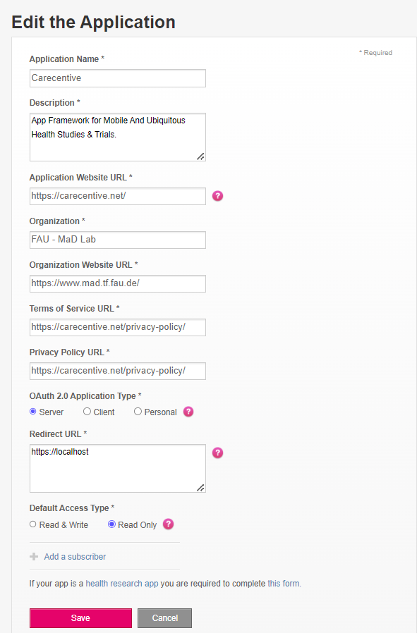

<!-- omit from toc -->
# Fitbit API Integration

- [Introduction](#introduction)
- [Console Setup](#console-setup)
- [Environment setup](#environment-setup)
- [Implementation](#implementation)

## Introduction

The details of the Fitbit API Integration in the Carecentive Framework will be discussed, including the necessary steps to set up the web console, update the environment file, and the implementation that has been done to access the Carecentive Core.

## Console Setup

In this section, the process of setting up the web console is described, including the proper configuration for essential settings such as application type, redirect URL, and access type.

1. Begin by creating an account on the [Fitbit Developer Portal](https://dev.fitbit.com/).
2. Register your application by completing the form found at [https://dev.fitbit.com/apps/new](https://dev.fitbit.com/apps/new).

Ensure to configure the following settings along with other fields:
- **Application Type**: `Server`
- **Redirect URL**: This is where the authorization code will be redirected from the Fitbit web API after successful authorization. Example: `https://localhost`
- **Default Access Type**: `Read Only`.

    

1. Once registered, essential information for the next section, including the Client ID and Client Secret, will be generated. These details can be accessed by navigating to your created application within the [Fitbit Developer Portal Apps](https://dev.fitbit.com/apps).

    

## Environment setup

This section focuses on the necessary steps to update credentials in the environment file.

1. Create a `.env` file and copy the content from the `.env.example` as stated in [getting started: Setting Up carecentive](https://carecentive.net/documentation/getting-started/).

2. Update the following information in the `.env` file:
 - **FITBIT_CLIENT_ID**: The Fitbit API application ID from [Fitbit Developer Portal Apps](https://dev.fitbit.com/apps). This ID is generated when registering an app in the earlier step.
 - **FITBIT_CLIENT_SECRET**: The application's client secret from [Fitbit Developer Portal Apps](https://dev.fitbit.com/apps). This string is generated when registering an app in the Fitbit developer account.
 - **FITBIT_BASIC_TOKEN**: The basic token is a base64-encoded concatenation of the client ID and secret, separated by a colon. This can be generated using [Base64Encode](https://www.base64encode.org/). Example: `client_id:client_secret` (e.g., `23R54P:dd877931a6399c585bb6f3d169e9a980` will generate a basic token `MjNSNTRQOmRkODc3OTMxYTYzOTljNTg1YmI2ZjNkMTY5ZTlhOTgw`).
 - **FITBIT_CODE_VERIFIER**: A code verifier is a cryptographically random value between 43-128 characters long. Example: `01234567890123456789012345678901234567890123456789`. 
   
   Note:
   1. Backend: This code verifier will be used during authorization to exchange the authorization code with the tokens such as access token, refresh token, etc.
   2. Frontend: A SHA-256 hash of the code verifier, base64url encoded with padding omitted, will be used when sending the request for authorization. Example: `-4cf-Mzo_qg9-uq0F4QwWhRh4AjcAqNx7SbYVsdmyQM`

## Implementation

* **Routing**: Adds necessary routing in [app.js](../../app.js) file for routing to the Carecentive core, particularly for authorization and user registration to the Carecentive platform.

* **Fetching Data**: Adds scripts in [pollFitbitData.js](../../scripts/pollFitbitData.js) to access the Carecentive Core. For instance, poll Fitbit data of all users and store it in the database using a scheduler.

Note: For more information, please visit the documentation of the Fitbit Web API: [Fitbit Web API Documentation](https://dev.fitbit.com/build/reference/web-api/)